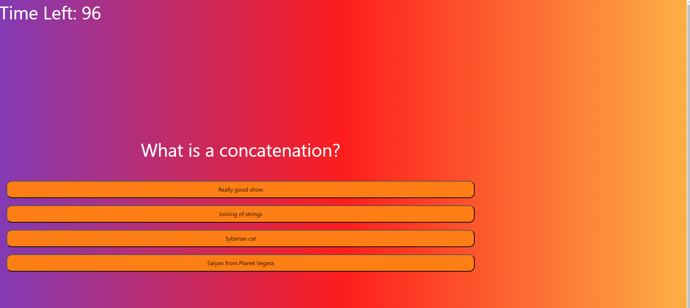
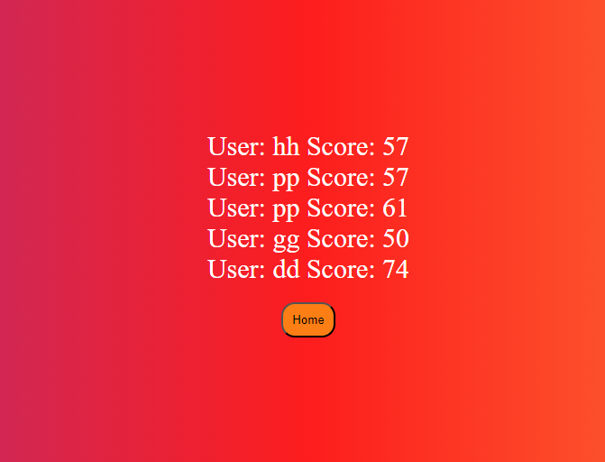

# El Quiz

Welcome to El Quiz! This is a quiz game that generates 5 coding questions for users to refresh their coding knowledge. When the user starts the game, a countdown timer starts. Everytime a user answers incorrectly, 10 seconds are subtracted from the time left, whatever the time left is at the end of the game will be your score. This app let's the user save their score to a local leaderboard.

________________________________________________

## Deployed Page URL: http://127.0.0.1:5500/Quizzler/index.html

_______________________________________________________

## Main Menu 

____________________________________________________

## Quiz 

_______________________________________________________

## Leaderboard

______________________________________________________

## This app was made using HTML, CSS, and JavaScript.

## License

Please refer to the license in the repository.

## Thank you!
